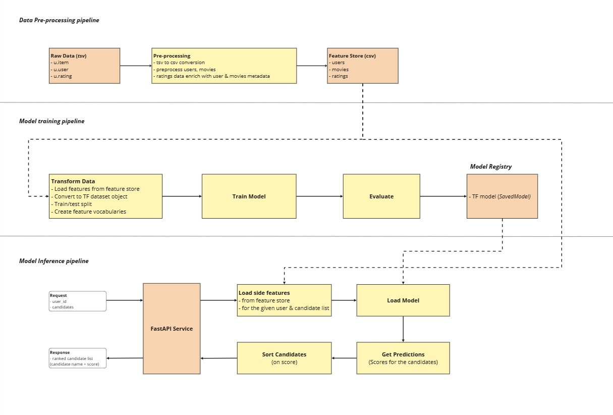

# TFRS-driven Personalized Movie Recommendations (Movielens-100k)

## 1. Approach

The designed recommender system generates ***ranked movie recommendations*** for a given user based on side features (user demographics and movie metadata) and past user-movie interaction data (hybrid approach). It utilizes a TensorFlow Recommenders (TFRS) Ranking Model with side features to model personalized recommendations. The system includes the following 3 pipelines:

1. **Data Preprocessing Pipeline**
2. **Model Training Pipeline**
3. **Model Inference (Ranking Logic) Pipeline**



---

#### 1. Data Preprocessing Pipeline

The preprocessing step handles the preparation of user, movie, and rating data.

**Key Steps:**
- Cleaning
- Feature Engineering
- tsv to csv conversion

> See: `src.preprocess.py`

---

#### 2. Model Training Pipeline

Built using the TensorFlow Recommenders framework. TFRS Ranking Model enriched with side features.

#### Model Design:

- Model Architecture: Separate user and movie towers (2-tower architecture) with embedding layers for each feature (`user_id`, `gender`, `occupation`, `movie_title`, `genres`).
- Loss Function: `RankingTask` with a regression objective using Mean Squared Error (MSE).
- Evaluation: Evaluated on a held-out test set using RMSE.

> See: `src.train.py`

---

#### 3. Inference Pipeline (FastAPI Service)

Recommendation inference endpoint is exposed via a FastAPI REST service.

#### Features:

- Accepts a **user ID** and a **list of candidate movie titles**.
- Looks up user and movie side features in feature store.
- Loads the TFRS model to **score candidate movies**.
- **Sort** the ranked candidates
- Returns a **sorted list of recommendations**.

> See: `src.app.py`

#### API Usage:

*endpoint*: `/recommendation/ranked_recommendation`

*method*: POST

*Payload:*
```json
{
  "user_id": "17",
  "candidate_movies": ["Toy Story (1995)", "GoldenEye (1995)", "Heat (1995)"]
}
```

## 2. Model Choice Rationale

## 3. How to run the code and reproduce results.
  - **Install dependencies**
      - `pip install -r requirements.txt`

  - **Data pre-processing pipeline**: `src.preprocess.py`
      - commands:
          ```
          cd src
          python preprocess.py
          ```
  
  - **Model training pipeline**: `src.train.py`
      - commands:
          ```
          cd src
          python train.py
          ```

  - **Model inference (ranking logic) FastAPI service**: `src.app.py`
      - commands to run FastAPI server:
          ```
          cd src
          fastapi run app.py --host 0.0.0.0 --port 8000
          ```
      - Endpoint: `http://localhost:8000/recommendation/ranked_recommendation`
      - Request type: POST
      - Request Body:
          ```
          {
              "user_id": "52", 
              "candidate_movies": [
                  "Toy Story (1995)", 
                  "GoldenEye (1995)"
                  ]
          }
          ```
        
### 4. **Exploratory Data Analysis (EDA)** can be found here.
> See: `notebooks.1_eda.ipynb`

### 5. Other Recommendation models trained can be found in the notebooks directory.
    
  -  ***random recommender*** baseline
  -  ***top-rated recommender*** baseline
  -  content-based model using ***sentence transformer*** embeddings
  -  ***collaborative filtering*** - item-based & user-based (librec library)
  -  ***lightfm*** hybrid recommender
  -  ***tfrs ranking*** model
  -  ***tfrs ranking with side features*** model